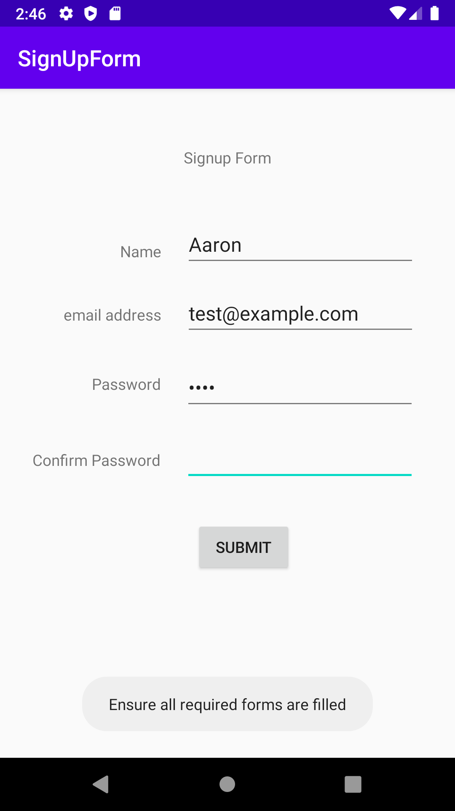
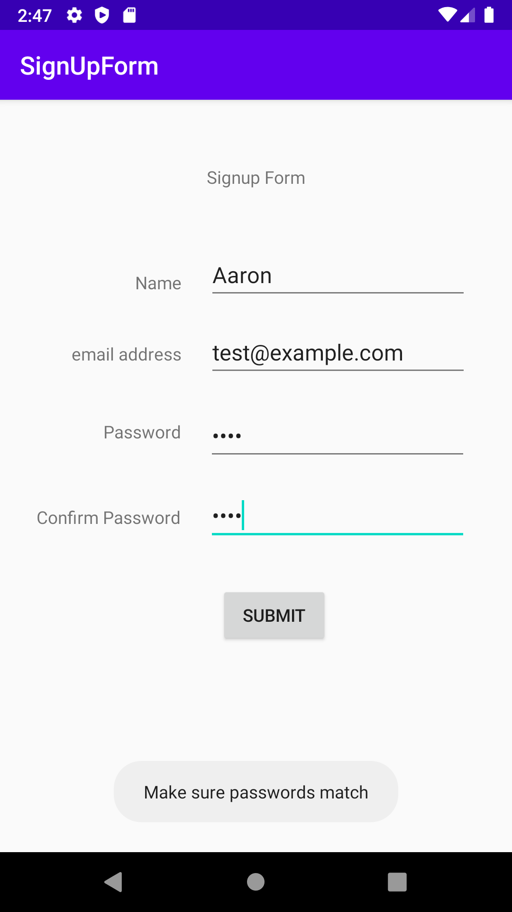
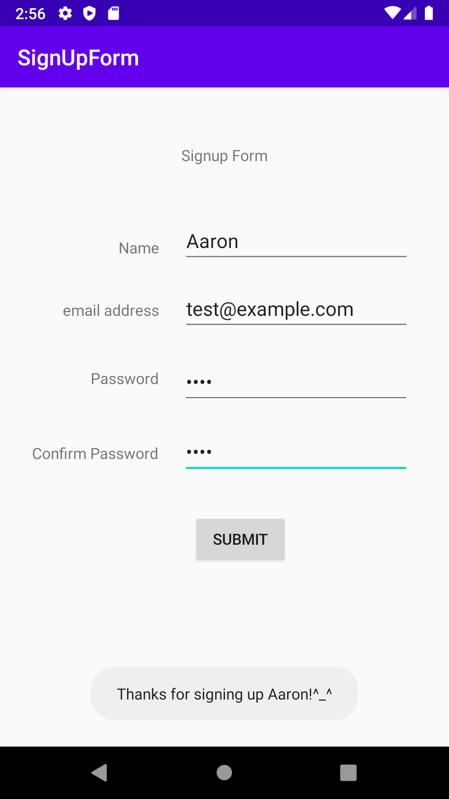

CIS 3515 Assignment 2
=====================
SignUpForm
----------
This is an application that check if all fields are filled out and the passwords match before giving
user a message thanking them for signing up

